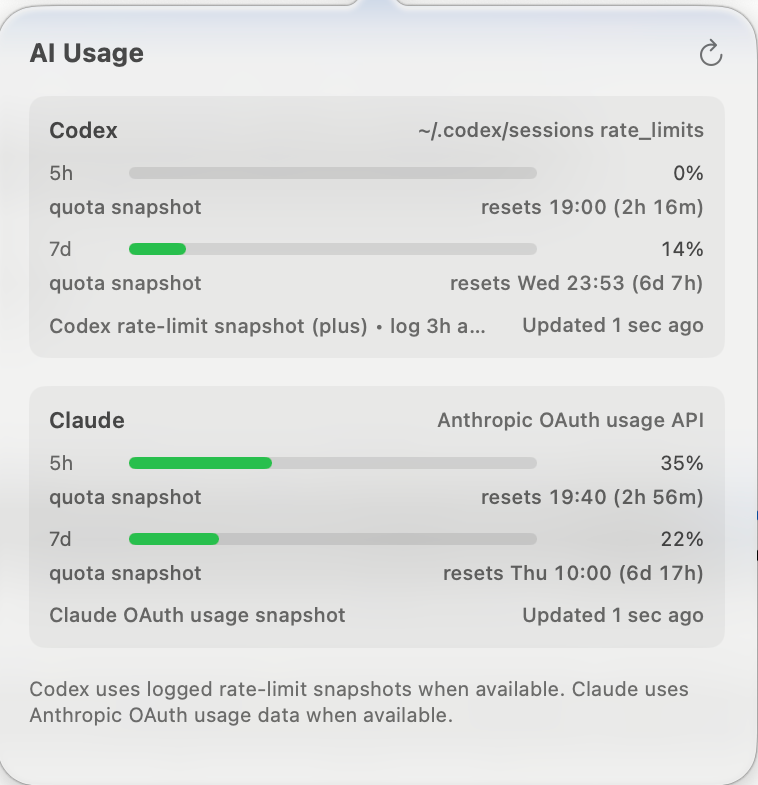

# Usage Meter

A lightweight macOS menu bar app that shows your [Claude](https://claude.ai) and [Codex](https://openai.com/codex) quota at a glance.




## What it does

Four vertical bars live in your menu bar — green, yellow, or red as usage rises:

| Bar | What it shows |
|-----|---------------|
| 1 | Codex 5-hour window |
| 2 | Codex 7-day window |
| 3 | Claude 5-hour window |
| 4 | Claude 7-day window |

Small dots under the bars show whether the corresponding agent appears to be
actively processing a turn. The Codex dot is driven by live Codex desktop
app-server events. The Claude dot uses Claude Code lifecycle hooks when enabled,
with local project activity as a fallback.

Click the icon to open a detail popover with exact percentages, reset times, and a timestamp showing how fresh the data is. Click anywhere outside to dismiss it.

**Data sources:**

- **Claude** — reads the [Anthropic OAuth usage endpoint](https://api.anthropic.com/api/oauth/usage) using the OAuth credentials Claude Code stores locally (the `Claude Code-credentials` Keychain item or `~/.claude/.credentials.json`). It refreshes an expired access token when it can; if the sign-in has fully lapsed it shows *"Claude Code sign-in expired — run `claude login`"*. Rate-limited or briefly-unavailable responses fall back to the most recent cached value, marked with `~`. Its activity dot uses [Claude Code hooks](https://code.claude.com/docs/en/hooks) for prompt, tool, stop, failure, permission, and idle events.
- **Codex** — reads the live ChatGPT usage endpoint (`chatgpt.com/backend-api/wham/usage`) using the OAuth credentials Codex stores in `~/.codex/auth.json`, so the figures match the Codex dashboard even when Codex has been idle. If the endpoint is unavailable it falls back to the most recent cached response, then to local `codex.rate_limits` log snapshots (`~/.codex/logs_2.sqlite`, legacy `~/.codex/sqlite/logs_2.sqlite`, or `~/.codex/sessions`), and finally to token-counting estimates. The activity dot selects the freshest database and supports both modern response-stream pulses and legacy app-server events.

Quota data refreshes every 2 minutes and also on every popover open. Activity
dots refresh every couple of seconds. The active-dot has a contrasting outline
so it stays visible on any menu-bar background, including live wallpapers.

## Requirements

- macOS 14 (Sonoma) or later
- **Claude**: [Claude Code](https://claude.ai/code) signed in locally — UsageMeter reads the OAuth credentials it stores. If Claude usage shows *"sign-in expired"*, run `claude login` (or `/login` in a Claude Code session) to refresh them. Enable the activity dot via **Enable Claude activity** in the popover.
- **Codex**: The [Codex desktop app](https://openai.com/codex) or CLI, signed in and used at least once.

## Install

### Option A — Download pre-built app (easiest)

1. Go to the [Releases page](../../releases) and download `UsageMeter.zip`.
2. Unzip and move `UsageMeter.app` to `~/Applications` (or `/Applications`).
3. Open it: `open ~/Applications/UsageMeter.app`

> **First launch note:** This build is not notarized. After attempting to open
> it once, go to **System Settings → Privacy & Security**, scroll to
> **Security**, and click **Open Anyway** beside UsageMeter. Authenticate and
> confirm **Open**. Apple makes this option available for about one hour after
> the blocked launch attempt.

If **Open Anyway** is unavailable and you built or downloaded UsageMeter from
this repository yourself, verify the bundle and remove only its quarantine
attribute:

```sh
codesign --verify --deep --strict --verbose=2 /Applications/UsageMeter.app
xattr -dr com.apple.quarantine /Applications/UsageMeter.app
open /Applications/UsageMeter.app
```

Use `~/Applications/UsageMeter.app` instead if that is where you installed it.
Do not use this workaround for apps from an untrusted source.

### Option B — Build from source

Requires Xcode command-line tools (`xcode-select --install`).

```sh
git clone https://github.com/PolymerTheory/usage-meter.git
cd usage-meter
./script/install_app.sh          # builds release binary, installs to ~/Applications
```

The script installs Claude activity hooks and launches UsageMeter when the
build finishes.

Pass `--debug` to build a debug binary instead:

```sh
./script/install_app.sh --debug
```

## Usage

UsageMeter runs as a menu bar accessory with no Dock icon. After opening it you should see four small bars appear in your menu bar. Click them to see the detail popover; click anywhere else to dismiss it.

On first launch, click **Enable Claude activity** in the popover. UsageMeter
merges its lifecycle hooks into `~/.claude/settings.json`; it does not replace
other Claude settings or hooks. Existing Claude Code sessions may need to be
restarted once after enabling the integration.

UsageMeter installs a per-user LaunchAgent (`io.github.PolymerTheory.UsageMeter`)
on first launch, so it starts automatically at login and is relaunched within
seconds if it ever exits unexpectedly — no need to add it to Login Items
manually. This is set up regardless of how the app arrived (install script,
manual download, or in-app update). To stop and remove it:

```sh
launchctl bootout "gui/$(id -u)/io.github.PolymerTheory.UsageMeter"
rm ~/Library/LaunchAgents/io.github.PolymerTheory.UsageMeter.plist
```

By default UsageMeter does **not** check or update on its own — nothing happens
in the background and there are no pop-ups. Use the **↓ button** in the popover
to check and install an update whenever you like.

If you'd rather it stay current hands-off, tick **Update automatically** at the
bottom of the popover (opt-in): it then checks every few hours and installs
updates silently, relaunching on the new version. Either way, Sparkle verifies
every download with the project's EdDSA signing key before replacing the app.

## Configuration (optional)

You can override the token limits used for Codex fallback estimates. Create `~/.usage-meter.json`:

```json
{
  "codex": {
    "shortWindowHours": 5,
    "longWindowDays": 7,
    "shortLimitTokens": 100000,
    "longLimitTokens": 500000
  }
}
```

These values only affect the estimated token-log mode. The live ChatGPT and Anthropic usage APIs (and exact Codex `rate_limits` snapshots) always take priority.

## Sync across devices (optional)

Off by default. If you run UsageMeter on more than one computer — or want to
glance at your usage on your phone — enable sync via the 📡 icon in the popover.
Each install publishes its usage to a small endpoint **you** control
(bring-your-own; no default server, only usage percentages are stored, never
tokens), so your machines share one account's numbers and a scannable **phone
view** can show them from anywhere.

- **Setup:** see **[docs/sync.md](docs/sync.md)** — a free **Supabase** Edge
  Function (recommended) or a **Cloudflare** Worker, both step-by-step.
- **Reduce cross-device polling:** an optional toggle makes only one device poll
  the provider APIs per interval while the others reuse the shared reading —
  handy with several machines.
- **Durable credentials:** your sync URL and token are mirrored to a backup in
  `~/Library/Application Support/UsageMeter/`, so they survive an accidental loss
  of `~/.usage-meter.json` and are restored automatically.

## Uninstall

```sh
# Stop and remove the auto-restart LaunchAgent first, otherwise it relaunches.
launchctl bootout "gui/$(id -u)/io.github.PolymerTheory.UsageMeter" 2>/dev/null
rm -f ~/Library/LaunchAgents/io.github.PolymerTheory.UsageMeter.plist
pkill -x UsageMeter
rm -rf ~/Applications/UsageMeter.app
rm -rf ~/Library/Caches/UsageMeter            # cached usage data
rm -rf ~/Library/Application\ Support/UsageMeter   # lock + sync-credential backup
```

## Known limitations

- **Claude live usage needs a valid Claude Code sign-in.** UsageMeter reads Claude Code's stored OAuth credentials and refreshes the access token when it can. If *both* the access and refresh tokens have expired, it shows a *"run `claude login`"* prompt until you re-authenticate. It does not decrypt the Claude desktop app's separate encrypted token cache.
- **Unofficial APIs.** The Anthropic OAuth usage endpoint, the ChatGPT usage endpoint, and the Codex log format are all undocumented and may change without notice. If usage data stops appearing, check the [Issues](../../issues) page.
- **Claude usage API lag.** The Anthropic usage endpoint is not real-time — figures can lag actual usage by a few minutes. If you have just hit your limit you may briefly see e.g. 95% before the API catches up to 100%.
- **Codex usage lag when offline.** Codex quota is normally live (via the ChatGPT usage endpoint). If that endpoint can't be reached, the app falls back to local log snapshots, which are only as fresh as the most recent Codex activity; such values are shown with a leading `~`.
- **Activity dots are best-effort.** The Codex dot depends on Codex desktop's local sqlite telemetry format. The Claude dot is deterministic when Claude Code lifecycle hooks fire, with a less precise local-log fallback before hooks are enabled.
- **Not notarized.** The app is built locally and is not signed with an Apple Developer certificate, so macOS will prompt you to confirm the first launch (see install note above).
- **macOS 14+ only.** The app uses SwiftUI APIs introduced in Sonoma.

## Troubleshooting

If either provider shows unavailable data, run the privacy-safe diagnostics
command and include its output in a bug report:

```sh
~/Applications/UsageMeter.app/Contents/MacOS/UsageMeter --diagnose
```

The report lists detected data locations and provider errors, but does not
print credentials, prompts, or conversation content.

## Building for release / creating a GitHub release

```sh
./script/release.sh v0.2.0            # build and sign the archive/feed
./script/release.sh --publish v0.2.0  # push feed and create GitHub release
```

Do not rebuild between these commands. The publish step verifies and uploads
the exact archive signed by the preparation step.

Release signing uses the private EdDSA key stored in the maintainer's macOS
Keychain. The corresponding public key is tracked in `.sparkle-public-key`.
Never export or commit the private key.

## Development

```sh
swift test                           # run unit tests
./script/build_and_run.sh --verify   # build, launch, and confirm menu bar item
./script/build_and_run.sh --debug --verify   # same with debug binary
```

## License

MIT — see [LICENSE](LICENSE).

The distributed app embeds [Sparkle](https://sparkle-project.org/) 2.9.3 under
its MIT license; the license text is included inside the app bundle.
